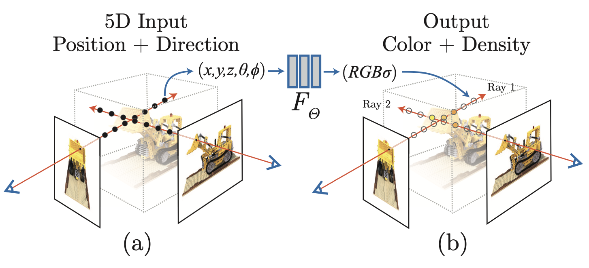
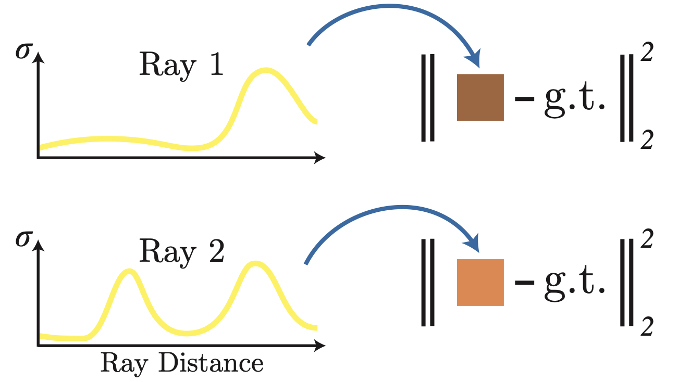

# Neural Radiance Field (NeRF)

Neural Radiance Field or NeRF is a technique to represent a scene in the form of a network of encoded information. In theory, it takes a series of images taken from different positions and perspectives of an object, and from a learned function, is able to produce novel views of the object. This technique was first introduced in the paper [NeRF: Representing Scenes as Neural Radiance Fields for View Synthesis](https://arxiv.org/abs/2003.08934) by Ben Mildenhall et al. in 2020.

This repository is an implementation of the ideas and techniques presented in the paper. 

## Intuition - Understanding the Paper

The abstract of the NeRF paper outlines the core concept of representing a scene using a deep fully connected neural network. The approach involves creating an encoded representation of a scene by training a deep neural network on a sparse set of images captured from various perspectives. Each image in the dataset is associated with known camera extrinsic and intrinsic parameters, enabling the calculation of the 3D positions of points in space where rays intersect with objects in the scene before reaching the camera.

  

This encoded representation allows the NeRF model to predict scene properties, such as color and density, for any point in space given its coordinates and the viewing direction. By overfitting the network to the sparse set of images, NeRF achieves high-fidelity rendering of scenes and enables the generation of novel views from arbitrary camera positions and orientations.

In essence, NeRFs are simple $Query Resolvers$ where resolution of a query involves marching along a ray in 3D space and looking up the network for the color and density. Using a deep neural network helps in extrapolating and predicting what the properties of a certain point in space would be, given the known properties of the points around it.

Inputs:
  - 3D point in space ($x$, $y$, $z$)
  - Viewing direction ($\theta$, $\phi$)

Outputs:
  - Color ($r$, $g$, $b$)
  - Density ($\sigma$)

By batching up different positions along a straight line along a viewing direction, we get a graph of the ray properties. 

  

